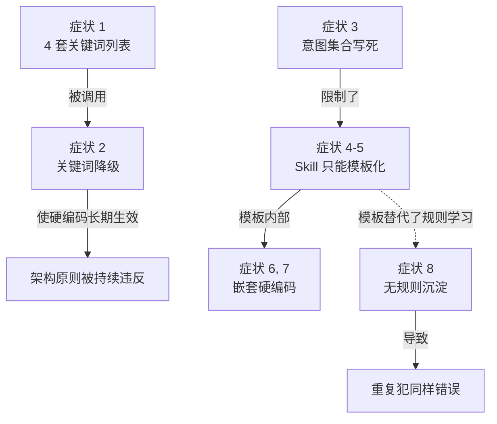

# AgentOS 任务执行架构漂移分析

> **报告生成时间**：2026-05-06
> **最近更新**：2026-05-06（Wave 5 完成 — Issue 003/012 Resolved：自适应正向规则注入 + 缓存失效修复）
> **检测范围**：AgentOS 任务执行链（路由 → 分类 → 规划 → Skill 创建 → 实体抽取/管理 → 规则学习）
> **基准文档**：[FEATURE_LIST.md (F001)](../FEATURE_LIST.md#f001-agentos-大模型驱动的任务执行架构)

---

## 概览

本报告分析的不是"docs 偏离了代码"，而是**代码偏离了 AgentOS 的核心架构原则**——即 F001 提出的"由大模型自主驱动任务执行"。docs 中的 F001 + 8 个 Known Issue 揭示的是这条原则在多个执行链节点上的违反情况。

| 维度 | 对齐状态 | 偏差程度 |
|------|---------|---------|
| 主路径 LLM 驱动（意图分类、任务规划） | ✅ 已对齐 | Low |
| 兜底路径仍由 LLM 完成（路由层） | ✅ 已修复（Wave 1） | Low |
| 兜底路径仍由 LLM 完成（执行层 LLM 调用） | ✅ 已修复（Wave 2） | Low |
| 长任务可观测性（Skill 进度日志 / 失败隔离） | ✅ 已修复（Wave 2） | Low |
| Skill 由大模型动态生成 | ✅ 已修复（Wave 3） | Low |
| Skill 内部解析也由 LLM 完成 | ✅ 已修复（Wave 3） | Low |
| 用户反馈沉淀为可应用的规则 | ✅ 已修复（Wave 4） | Low |
| 意图集合可由注册表扩展 | ✅ 已修复（Wave 6） | Low |
| 前端长任务进度渲染 | ✅ 已修复（Wave 3.5） | Low |

**总体评级**：🟡 **架构层漂移持续修复中** — Wave 1/2/3/4 已完成；剩余 Issue（003/007/011）待处理。F001 必须全部成立，AgentOS 其它 Feature 才有真正"AI 自主"的语义。

**修复进度**：
- ✅ Wave 1（005, 006）：路由层硬编码已移除，引入 LLM 兜底链（2026-05-06）
- ✅ Wave 2（009, 010）：执行层 `safe_llm_call_sync` 重试封装；`entity_extract` Skill 重写带缓存/日志/progress_cb；后端 SSE 桥接（2026-05-06）
- ✅ Wave 3（001, 008）：`_CAPABILITY_TEMPLATES` 删除；`_handle_create_skill` 改为 LLM 生成 + `ast.parse` 校验；entity_exclusion 路径改为 LLM 意图解析；新建 `entity_exclude.py` Skill 无正则（2026-05-06）
- ✅ Wave 4（002, 004）：`extraction_rules` 表 + `rule_manager.py` + `rule_learning` 意图 + 抽取时自动加载规则 + 排除时自动保存 `exclude_source` 规则（2026-05-06）
- ✅ Wave 3.5（011）：`TeamChatEvent` 加 progress/heartbeat 类型；SubTaskCard 进度条；progressMap state；plan_created/subtask_completed 时自动清理进度（2026-05-06）
- ✅ Wave 5（003, 012）：扩展 rule_type 到 focus_on/strategy；`build_extraction_exclusion_text` 正负向规则双注入；entity_extract Skill 有规则时自动绕过缓存（2026-05-06）
- ✅ Wave 6（007）：build_intent_registry 动态注册表；Skill 声明 intent → 自动纳入分类 prompt；通用 Skill 意图分发路径（2026-05-06）

---

## 一、已对齐的部分（不要因为后面的问题就忽略它）

| 已实现且符合 F001 的能力 | 位置 | 说明 |
|------------------------|------|------|
| LLM 意图分类主路径 | [`backend/routes/chat.py:97-134`](../../backend/routes/chat.py) `classify_intent` | 主路径调用 LLM 做意图判定，10 秒超时 |
| LLM 任务规划 | [`backend/orchestrator.py:157-217`](../../backend/orchestrator.py) `plan_task` | LLM 根据能力清单和工位状态生成 TaskPlan（JSON 输出） |
| 动态 SubAgent 创建 | [`backend/orchestrator.py:_run_subtask`](../../backend/orchestrator.py) | 根据规划动态创建 Agent，分配能力 |
| 能力注册表（合理的硬编码）| [`backend/orchestrator.py:20-72`](../../backend/orchestrator.py) `CAPABILITY_REGISTRY` | 内置能力清单是合理的"可被 LLM 引用"，不是路由判定 |

> 注：`CAPABILITY_REGISTRY` 是清单（用于告诉 LLM 系统有哪些工具可用），不是路由触发器（不参与"用户消息属于哪类意图"的判定），属于合理硬编码。

---

## 二、偏离 F001 的硬编码症状全清单（共 8 处）

按"严重程度 / 主路径影响面"排序：

| # | 症状 | 位置 | 违反原则 | 严重度 | 关联 Issue |
|---|------|------|----------|--------|----------|
| 1 | ~~意图路由 4 套硬编码关键词列表~~ | ~~`chat.py:23-35` 等 4 处~~ | 1 | ✅ 已修复 2026-05-06 | [005](../KNOWN_ISSUES.md#005-意图路由依赖-4-套硬编码关键词列表) |
| 2 | ~~意图分类失败即降级到关键词~~ | ~~`chat.py:128-147` `_keyword_fallback`~~ | 2, 5 | ✅ 已修复 2026-05-06 | [006](../KNOWN_ISSUES.md#006-意图分类失败降级到硬编码关键词) |
| 3 | 意图集合写死 5 类 | [`chat.py`](../../backend/routes/chat.py) `_CLASSIFY_PROMPT` + `_VALID_INTENTS` | 1, 3 | 🟡 High | [007](../KNOWN_ISSUES.md#007-意图类别枚举写死无法扩展) |
| 4 | ~~`_CAPABILITY_TEMPLATES` 静态 Skill 代码~~ | ~~`chat.py`~~ | 3 | ✅ 已修复 2026-05-06（Wave 3） | [001](../KNOWN_ISSUES.md#001-系统使用硬编码模板而非动态生成技能) |
| 5 | ~~`_handle_create_skill` 仅做模板复制~~ | ~~`chat.py`~~ | 3 | ✅ 已修复 2026-05-06（Wave 3） | [001](../KNOWN_ISSUES.md#001-系统使用硬编码模板而非动态生成技能) |
| 6 | ~~Skill 模板内嵌硬编码正则提取文档名~~ | ~~`chat.py` / `entity_exclude.py`~~ | 1 | ✅ 已修复 2026-05-06（Wave 3） | [008](../KNOWN_ISSUES.md#008-skill-内嵌硬编码正则做文档名提取) |
| 7 | ~~实体排除/恢复方向靠关键词判定~~ | ~~`chat.py`~~ | 1 | ✅ 已修复 2026-05-06（Wave 3） | [008](../KNOWN_ISSUES.md#008-skill-内嵌硬编码正则做文档名提取) |
| 8 | 实体排除是数据操作没有规则沉淀 | [`chat.py:540-553`](../../backend/routes/chat.py)；缺少 `extraction_rules` 表 | 4 | 🟡 High | [002](../KNOWN_ISSUES.md#002-缺少对话式实体抽取规则学习机制), [004](../KNOWN_ISSUES.md#004-实体排除功能无学习能力会重复错误) |

### 症状之间的因果与依赖关系

---

## 三、期望架构对比

| 维度 | 现状 | 期望 |
|------|------|------|
| 用户消息进入系统 | LLM 主路径 + 关键词降级（4 套列表）| 仅 LLM；失败时切换更小模型/简化 prompt 重试 |
| 意图集合 | 写死 5 类 | 由 Skill 注册表动态拼装 |
| Skill 创建 | 触发词匹配 → 字符串模板 → 写文件 | LLM 生成完整代码（注入项目规则、用户偏好、文档特征）→ 沙箱校验 |
| Skill 内部解析 | 嵌套正则/关键词 | 内部也通过结构化 LLM 调用 |
| 用户反馈处理 | 仅删除已抽取实体 | 1) LLM 解析成结构化规则 → 2) 持久化 → 3) 删除当前实体 → 4) 后续抽取自动加载 |
| 规则可追溯 | 无 | 每条规则记录"在哪次会话/哪条消息中被设定" |

---

## 四、漂移根本原因分析

### 1. 演进顺序导致硬编码"叠加"而非"替换"

代码演进经历了：
1. **早期**：纯硬编码路由（4 套 `_*_KEYWORDS`）
2. **中期**：引入 LLM 意图分类（`classify_intent`）
3. **现在**：LLM 作为主路径，但**没删除原硬编码**，反而把硬编码升格为"降级兜底"

结果是硬编码和 LLM 同时存在，硬编码事实上始终生效。

### 2. "防御性编程"压过了架构原则

每一处关键词降级、模板兜底、嵌套正则都是出于"LLM 不靠谱时也得能跑"的防御性思维。但 F001 的核心主张是：**就算要兜底，也必须仍是 LLM**。这种思维转换没有发生。

### 3. Skill 系统设计层错位

`_CAPABILITY_TEMPLATES` + `_handle_create_skill` 把"封装为技能"理解为"复制一段代码到 skills/ 目录"，而不是"让 LLM 根据上下文生成针对性代码"。这一层错位让 F001 的原则 3、4 无法落地（没有真正的动态生成，就没有规则可注入；没有规则沉淀，就没有自适应抽取）。

---

## 五、修正建议（与 [`KNOWN_ISSUES.md`](../KNOWN_ISSUES.md) 同步）

按依赖关系建议分 5 波修复：

| 波次 | 涉及 Issue | 修复内容 | 修复后能验证的 F001 原则 |
|------|----------|---------|--------------------------|
| 第 1 波 | 005 + 006 | 删除 4 套关键词列表 + 引入 LLM 兜底链 | 原则 1, 2, 5 |
| 第 2 波 | 001 + 008 | LLM 生成 Skill + Skill 内部去硬编码 | 原则 3 |
| 第 3 波 | 002 + 004 | 引入 `extraction_rules` 表与规则学习闭环 | 原则 4 |
| 第 4 波 | 003 | 抽取流程加载并应用规则 | 原则 1 + 4 在抽取场景的体现 |
| 第 5 波 | 007 | 意图集合从 Skill 注册表动态生成 | 原则 1 + 3 |

每一波修复都遵循 TDD：先写违反原则的反例测试 → 修复 → 测试通过 → 对照 F001 验收标准勾选。

---

## 六、严重程度评级

| 偏差类型 | 严重程度 | 修复优先级 |
|---------|---------|-----------|
| 路由层硬编码（症状 1, 2）| 🔴 Critical | P0 — 第 1 波 |
| Skill 生成层硬编码（症状 4, 5）| ✅ 已修复 2026-05-06（Wave 3） | — |
| 规则学习缺失（症状 8）| 🟡 High | P1 — 第 3 波 |
| 意图集合写死（症状 3）| 🟡 High | P1 — 第 5 波 |
| Skill 内部嵌套硬编码（症状 6, 7）| 🟠 Medium | P2 — 第 2 波顺带 |

---

## 七、结论

**核心结论**：当前实现并没有"完全偏离需求"。主路径（意图分类、任务规划、SubAgent 动态执行）已经正确地按"LLM 驱动"实现。**真正的问题是**：

1. **降级方案、Skill 创建、Skill 内部解析、用户反馈处理这 4 个关键支线全部回落到硬编码**，使硬编码事实上始终参与执行
2. **缺少规则学习闭环**，使用户反馈无法转化为对未来抽取的约束

这些问题不是"实体抽取功能的 bug"，而是 AgentOS 架构原则在多个执行链节点上的违反。docs 中现有的 F001 + 8 个 Issue **不是漂移文档，而是这一架构原则的明确化与缺口梳理**。

完成 F001 的全部 8 个 Issue 修复后：
- AgentOS 才真正具备"对话中由大模型自主执行任务"的语义
- WorkAgent 编排（F-013/F-020）、Sub-Agent 动态调用（F-017）、HubAgent Skill 创建引导（F-023）、知识图谱自动沉淀（F-029/F-030）等其它 Feature 才能在正确的架构基底上实现

---

**下一步**：Wave 1（005, 006）、Wave 2（009, 010）、Wave 3（001, 008）均已完成。建议启动 Wave 4 修复 [Issue 002](../KNOWN_ISSUES.md#002-缺少对话式实体抽取规则学习机制) + [Issue 004](../KNOWN_ISSUES.md#004-实体排除功能无学习能力会重复错误)，引入 `extraction_rules` 表与规则学习闭环，使用户反馈能持久化为下次抽取的约束。
